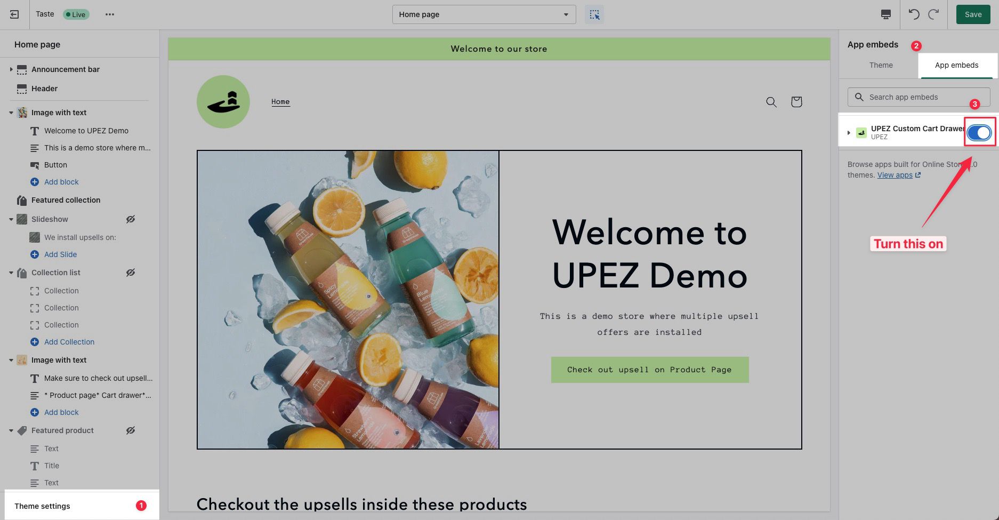

# How to install UPEZ Custom Cart



1.  Go to your **Shopify Admin**, navigate to **Online Store** and click the **Customize** button on your live theme.

    <figure><figcaption></figcaption></figure>
2.  Click **Theme settings** on the bottom left corner, then select the **App-embeds** tab on the right panel, then make sure that the toggle button for **UPEZ Custom Cart Drawer** is **ON**

    <figure><figcaption></figcaption></figure>
3. And congratulations, you have successfully installed the UPEZ Custom Cart Drawer.&#x20;







